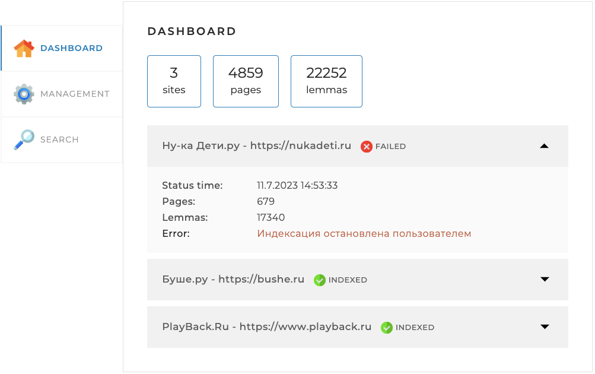
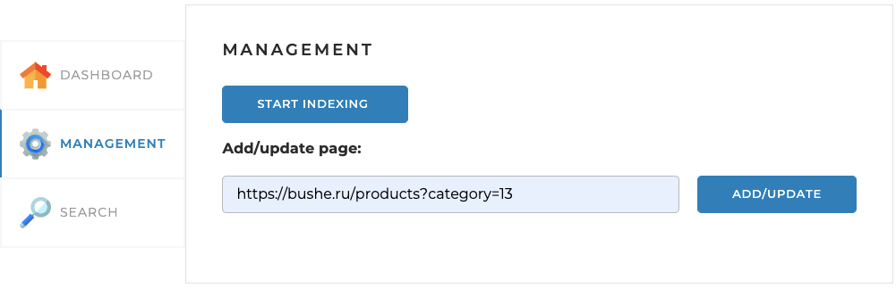
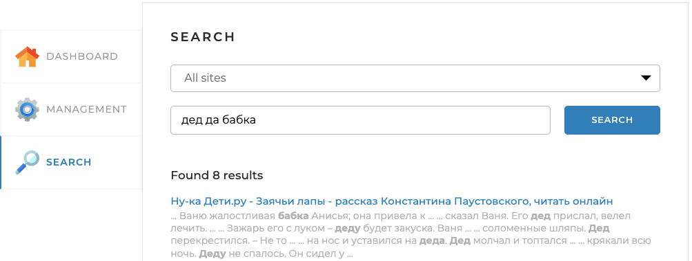

# Локальный поисковый движок по сайту
<hr>

Поисковый движок представляет из себя Spring-приложение, работающее с локально установленной базой данных MySQL.
Имеет простой веб-интерфейс (одна веб-страница с тремя вкладками) и API, через который приложением можно управлять
и получать результаты поисковой выдачи по запросу.
Приложение индексирует страницы сайта и по поисковому запросу определяет наиболее релевантные страницы 
с учётом морфологии русского языка.

## Настройки для запуска
<hr>

### Зависимости
В файле `pom.xml` добавлен репозиторий:

```xml
<repositories>
  <repository>
    <id>skillbox-gitlab</id>
    <url>https://gitlab.skillbox.ru/api/v4/projects/263574/packages/maven</url>
  </repository>
</repositories>
```

Для доступа к данному репозиторию необходимо авторизроваться по токену.
Как указать токен смотри [тут](https://github.com/skillbox-java/springMorphologyExample/blob/master/README.md).

### Настройки подключения к БД
Создайте в MySQL-сервере пустую базу данных search_engine с кодировкой **utf8mb4**.
В файле конфигурации `src/resources/application.yml` замените имя пользователя,
который имеет доступ к созданной базе данных (по умолчанию **root**), и пароль:

```yaml
spring:
  datasource:
    username: root # имя пользователя
    password: password # пароль пользователя
```

### Настройка идентификационной строки клиентского приложения
В файле конфигурации `src/resources/application.yml` замените **User-Agent** и **referrer**:

```yaml
jsoup-settings:
  userAgent: Mozilla/5.0 (Macintosh; Intel Mac OS X 10_15_7) AppleWebKit/537.36 (KHTML, like Gecko) Chrome/114.0.0.0 Safari/537.36
  referrer: http://www.google.com
```

Узнать User-Agent можно [тут](https://ciox.ru/check-user-agent).

## Развертывание
<hr>

* Перед запуском приложения в файле конфигурации `src/resources/application.yml`
 задайте адреса сайтов, по которым движок осуществляет поиск:

```yaml
indexing-settings:
  sites:
    - url: https://nukadeti.ru
      name: Ну-ка Дети.ру
    - url: https://bushe.ru
      name: Буше.ру
    - url: https://www.playback.ru
      name: PlayBack.Ru
```

* Затем запустите приложение и откройте его через браузер по адресу: http://localhost:8080/.
На странице откроется вкладка **Dashboard**. На ней отображается общая статистика
по всем сайтам, а также детальная статистика и статус по каждому из сайтов:



* Перейдите на вкладку **Management**. На ней находятся инструменты управления поисковым движком 
— запуск и остановка полной индексации (переиндексации),
а также возможность добавить (обновить) отдельную страницу по ссылке:



Запустите полную индексацию и дождитесь ее завершения. Для отображения актуальной информации на вкладке **Dashboard** 
обновите страницу http://localhost:8080/.

* Затем перейдите на вкладку **Search**, где находятся поле поиска, выпадающий список с выбором сайта для поиска.
Введите фразу и нажмите на кнопку «Найти», чтобы вывелись результаты поиска:



## Приложение разработанно с использованием
<hr>

* Java-фреймворка Spring
* Системы сборки Maven

## Проверка работы локального поискового движка по сайту
<hr>
Проиндексируйте несколько сайтов и запустите поиск по фразам,
которые встречаются на определённых страницах каждого сайта и
не встречаются на других сайтах, а затем сравните результат с 
ожидаемым. При запросе фразы, существующей на странице сайта,
эта страница должна быть найдена и должна иметь высокую релевантность,
а при запросе несуществующей на сайте фразы должен быть выдан пустой список.

## Благодарности
<hr>

* Даниилу Пилипенко - спикер курса "Java-разработчик"
* Кириллу Кошаеву - спикер курса "Java-фреймворк Spring"
* Константиту Шибкову - куратор курсов по професии "Java-разработчик PRO"
* Максиму Водолажскому - куратор по курсу "Java-разработчик"
*  - куратор по итоговому проекту курса "Java-разработчик"


